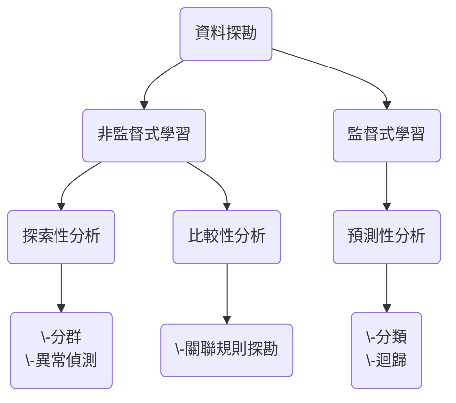

>**目的**
>尋找資料間的關係

**統計分析**：利用現有資料的==樣本==，*解釋* 現有資料的==母體==。
**機器學習**：利用==過去==資料，*預測* ==未來==資料。
**資料探勘**：找出==資料背後==隱含的很常一起出現的*關聯* 關係。
***
# 資料探勘演算法

|分析方法     |類別     |
| --- | --- |
|- 分類分析（Classification） - 群集分析（Clustering）|機器學習|
|- 關聯分析（Association） - 順序型態分析（Sequential Pattern Analysis） |資料探勘|
|- 時間序列分析（Time Series Forecasting） |統計學|

**監督式**：有預設答案  
**非監督式**：沒有預設答案

## 關聯規則與算法
**關聯中的強規則**
強規則是指能夠量化定義的⼀種衡量⽅式，⽤來找出資料中的模式
- 頻繁樣式（frequent patterns ）：很常⼀起共同出現的資料組合。
- 資料間的關聯（ associations ）
- 因果結構（ causal structures ）
### 關聯規則的數學定義
> $X \to Y[s,c]$  
> $\text{Confidence}(A, B) = P(B | A) = \dfrac{\text{Support}( A + B )}{\text{Support}( A )}$
- X, Y：代表所有資料元素所組成的部分集合
- s 是 Support 值：代表在所有資料集中， X 與 Y 共同出現的⽐例 $\to$ ==找出熱門組合==
- c 是 Confidence 值：代表在所有出現 X 在資料集中也出現 Y 的⽐例 $\to$ ==是否可靠==

#### 演算法
- 找出所有頻繁項⽬集
- 找出頻繁項⽬集中具有強關聯規則的規則
#### Apriori Algorithm
- 優點：易編碼實現
- 缺點：在大資料集上可能較慢
- 適用資料型別：數值型 或者 標稱型資料。

Apriori Algorithm 採⽤由下⽽上的處理⽅法，即頻繁⼦集每次只擴充⼀個物件的候選集產⽣⽅法，並且候選集由資料進⾏檢驗。當不再產⽣符合條件的擴充物件時，演算法終⽌。

>從數量低的集合開始做起，當發現這個某個集合不是頻繁的，則他的⺟集合也不需要考慮。這樣可以⼤幅縮減計算的複雜度。
##### 例⼦
**設定**
Min_Support=1
**資料**

|交易序號|購品商品組合|
| :--: | :--:|
| 2000 |1, 3, 4|
|1000 |2, 3, 5|
|4000 |1, 2, 3, 5|
|5000 |2, 5 |

**塞選出熱門商品**
> 核心：熱門組合裡的元素一定是熱門商品
> 同理，非熱門商品一定不是熱門組合裡的元素

|候選集組合 |出現次數|
|:--:|:--:|
|{1} |2|
|{2}| 3|
|{3} |3|
|*{4}* |*1*|
|{5} |3|

*$\Rightarrow$刪除不熱門元素（可自行定義界線標準）*

|候選集組合 |出現次數|
|:--:|:--:|
|{1} |2|
|{2}| 3|
|{3} |3|
|{5} |3|

*考慮兩個一組*

|候選集組合 | 出現次數|
|:--:|:--:|
|*{1, 2}*|*1*|
|{1, 3}|2|
|*{1, 5}*|*1*|
|{2, 3}|2|
|{2, 5}|3|
|{3, 5}|2|

*$\Rightarrow$刪除不熱門組合（可自行定義界線標準）*

|候選集組合 | 出現次數|
|:--:|:--:|
|{1, 3}|2|
|{2, 3}|2|
|{2, 5}|3|
|{3, 5}|2|

*考慮三個一組，裡面任兩個都要屬於上面的熱門組合*

|候選集組合 | 出現次數|
|:--:|:--:|
|{2, 3, 5}|2|

*所有熱門組合*
> {1}, {2}, {3}, {5}, {1, 3}, {2, 3}, {2, 5}, {3, 5}, {2, 3, 5}
###### Association Rules
**設定**
min_confidence=100%
*看最⼤頻繁⼦集{2, 3, 5}*

|Pattern| Confidence|
|:--:|:--:|
|{2, 3} → {5}| 2 / 2 = 100%|
|{2, 5} → {3}| 2 / 3 = 67%|
|{3, 5} → {2}|2 / 2 = 100%|
|{2} → {3, 5}| 2 / 3 = 67%|
|{3} → {2, 5}|2 / 3 = 67%|
|{5} → {2, 3}| 2 / 3 = 67%|

*繼續考慮其他可能*

|Pattern| Confidence|
|:--:|:--:|
|{3} → {5}| 2 / 3 = 67%|
|{5} → {3}| 2 / 3 = 67%|
|{2} → {5}| 3 / 3 = 100%|
|{5} → {2}| 3 / 3 = 100%|
|{3} → {2}| 2 / 3 = 67%|
|{2} → {3}| 2 / 3 = 67%|
|{1} → {3}| 2 / 2 = 100%|
|{3} → {1}| 2 / 3 = 67%|
###### 結論
$\begin{cases} \text{Min\_Support}=1\\ \text{min\_confidence}=100\% \end{cases}\Rightarrow$

|Pattern| Confidence|
|:--:|:--:|
|{2, 3} → {5}| 2 / 2 = 100%|
|{3, 5} → {2}|2 / 2 = 100%|
|{2} → {5}| 3 / 3 = 100%|
|{5} → {2}| 3 / 3 = 100%|
|{1} → {3}| 2 / 2 = 100%|

## 順序型態分析
循序樣式探勘的⽬的是找出顧客在*不同時間點* 所購買的物品*先後之關係*。  
與關聯規則不同在於  
**關聯規則**：一個時間點  
**序列模式**：多個時間點  
*注意⚠️*序列與子序列  

| Data sequence                | Subsequence    | Contain? |
|--|--|----------|
| `< {2,4} {3,5,6} {8} >`      | `< {2} {3,5} >` | Yes      |
| `< {1,2} {3,4} >`            | `< {1} {2} >`   | No       |
| `< {2,4} {2,4} {2,5} >`      | `< {2} {4} >`   | Yes      |

### GSP 算法
GSP（ Generalized Sequential Patterns）算法是 Apriori 算法的擴展算法。
#### 例子1
**設定**  
min_sup=2  
**資料**  

| Seq. ID | Sequence           |
|---------|--------------------|
| 10      | `<(bd)cb(ac)>`     |
| 20      | `<(bf)(ce)b(fg)>`  |
| 30      | `<(ah)(bf)abf>`    |
| 40      | `<(be)(ce)d>`      |
| 50      | `<a(bd)bcb(ade)>`  |

**塞選出熱門商品**

| Cand | Sup |
|------|-----|
| `<a>` | 3  |
| `<b>` | 5  |
| `<c>` | 4  |
| `<d>` | 3  |
| `<e>` | 3  |
| `<f>` | 2  |
| ~~`<g>`~~ | ~~1~~ |
| ~~`<h>`~~ | ~~1~~ |

**從數量低的集合開始增加候選集**  
*有順序*  

|    | `<a>`  | `<b>`  | `<c>`  | `<d>`  | `<e>`  | `<f>`  |
|:--:|:--:|:--:|:--:|:--:|:--:|:--:|
| `<a>` | `<aa>` | `<ab>` | `<ac>` | `<ad>` | `<ae>` | `<af>` |
| `<b>` | `<ba>` | `<bb>` | `<bc>` | `<bd>` | `<be>` | `<bf>` |
| `<c>` | `<ca>` | `<cb>` | `<cc>` | `<cd>` | `<ce>` | `<cf>` |
| `<d>` | `<da>` | `<db>` | `<dc>` | `<dd>` | `<de>` | `<df>` |
| `<e>` | `<ea>` | `<eb>` | `<ec>` | `<ed>` | `<ee>` | `<ef>` |
| `<f>` | `<fa>` | `<fb>` | `<fc>` | `<fd>` | `<fe>` | `<ff>` |

*同時*

|    | `<a>`  | `<b>`  | `<c>`  | `<d>`  | `<e>`  | `<f>`  |
|:--:|:--:|:--:|:--:|:--:|:--:|:--:|
| `<a>` || `<(ab)>` | `<(ac)>` | `<(ad)>` | `<(ae)>` | `<(af)>` |
| `<b>` ||        | `<(bc)>` | `<(bd)>` | `<(be)>` | `<(bf)>` |
| `<c>` ||        |        | `<(cd)>` | `<(ce)>` | `<(cf)>` |
| `<d>` | |       |        |        | `<(de)>` | `<(df)>` |
| `<e>` |  |      |        |        |        | `<(ef)>` |
| `<f>` |        |        |        |        |        |  |
#### 例子2  
**設定**  
min_sup=1  
**資料**  

| 使用者 | 購買商品組合                 |
|--------|------------------------------|
| 2000   | `<(cd)(abc)(abf)(acdf)>`     |
| 1000   | `<(abf)(e)>`                 |
| 4000   | `<(abf)>`                    |
| 5000   | `<(dgh)(bf)(agh)>`           |

*候選集組合 & 出現次數*

| 候選集組合 | 出現次數 |
|------------|--------|
| `<a>`      | 4      |
| `<b>`      | 4      |
| ~~`<c>`~~      | ~~1~~      |
| `<d>`      | 2      |
| ~~`<e>`~~   | ~~1~~    |
| `<f>`      | 4      |
| ~~`<g>`~~      | ~~1~~      |
| ~~`<h>`~~      | ~~1~~      |

*篩選後的候選組合*

| 候選集組合 | 出現次數 |
|------------|--------|
| `<a>`      | 4      |
| `<b>`      | 4      |
| `<d>`      | 2      |
| `<f>`      | 4      |

*序列擴展表*

| | `<a>` | `<b>` | `<d>` | `<f>` |
|:--:|:--:|:--:|:--:|:--:| 
| `<a>` | `<aa>` | `<ab>` | `<ad>` | `<af>` | 
| `<b>` | `<ba>` | `<bb>` | `<bd>` | `<bf>` | 
| `<d>` | `<da>` | `<db>` | `<dd>` | `<df>` | 
| `<f>` | `<fa>` | `<fb>` | `<fd>` | `<ff>` |

*同步擴展表*

| | `<a>` | `<b>` | `<d>` | `<f>` | 
|:--:|:--:|:--:|:--:|:--:| 
| `<a>` | | `<(ab)>` | `<(ad)>` | `<(af)>` | 
| `<b>` | | | `<(bd)>` | `<(bf)>` | 
| `<d>` | | | | `<(df)>` |
|`<f>`|||||

*候選集組合 (第二部分)*

| 候選集組合 | 出現次數 | 
|:--:|:--:| 
| `<aa>` | 1 | 
| `<ab>` | 1 | 
| `<ad>` | 1 | 
| `<af>` | 1| 
| `<ba>` | 2 | 
| `<bb>` | 1 | 
| `<bd>` | 1 | 
| `<bf>` | 1 | 
| `<da>` | 2 | 
| `<db>` | 2 | 
| `<dd>` | 1 | 
| `<df>` | 2 |
| `<fa>` | 2 | 
| `<fb>` | 0 | 
| `<fd>` | 1 | 
| `<ff>` | 1 |
| `<(ab)>` | 4 | 
| `<(ad)>` | 1 | 
| `<(af)>` | 4 | 
| `<(bd)>` | 0 |
| `<(bf)>` | 4 |
| `<(df)>` | 1 |

*篩選候選組合（第二部分）*

| 候選集組合 | 出現次數 | 
|:--:|:--:| 
| `<ba>` | 2 | 
| `<da>` | 2 | 
| `<db>` | 2 | 
| `<df>` | 2 |
| `<fa>` | 2 | 
| `<(ab)>` | 4 | 
| `<(af)>` | 4 | 
| `<(bf)>` | 4 |

*候選集組合 (第三部分)*

| 候選集組合 | 出現次數 | 
|:--:|:--:| 
| `<(ab)a>` | 1 | 
| `<(bf)a>` | 2 | 
| `<b(ab)>` | 1 | 
| `<b(af)>` | 1 | 
| `<d(ab)>` | 1 | 
| `<d(af)>` | 1 | 
| `<d(bf)>` | 2 | 
| `<f(ab)>` | 0 | 
| `<f(af)>` | 1 | 
| `<(af)a>` | 1 | 
| `<(abf)>` | 3 | 

*篩選候選組合（第三部分）*

| 候選集組合 | 出現次數 | 
|:--:|:--:| 
| `<(bf)a>` | 2 | 
| `<d(bf)>` | 2 | 
| `<(abf)>` | 3 | 

*候選集組合 (第四部分)*

| 候選集組合 | 出現次數 | 
|:--:|:--:| 
| `<d(bf)a>` | 2 | 
| `<(abf)a>` | 1 |
| `<(bf)(abf)>` | 0 |
| `<d(abf)>` | 1 |

*篩選候選組合（第四部分）*

| 候選集組合 | 出現次數 | 
|:--:|:--:| 
| `<d(bf)a>` | 2 | 

##### 結論
> $d \to (b f) \to a$
